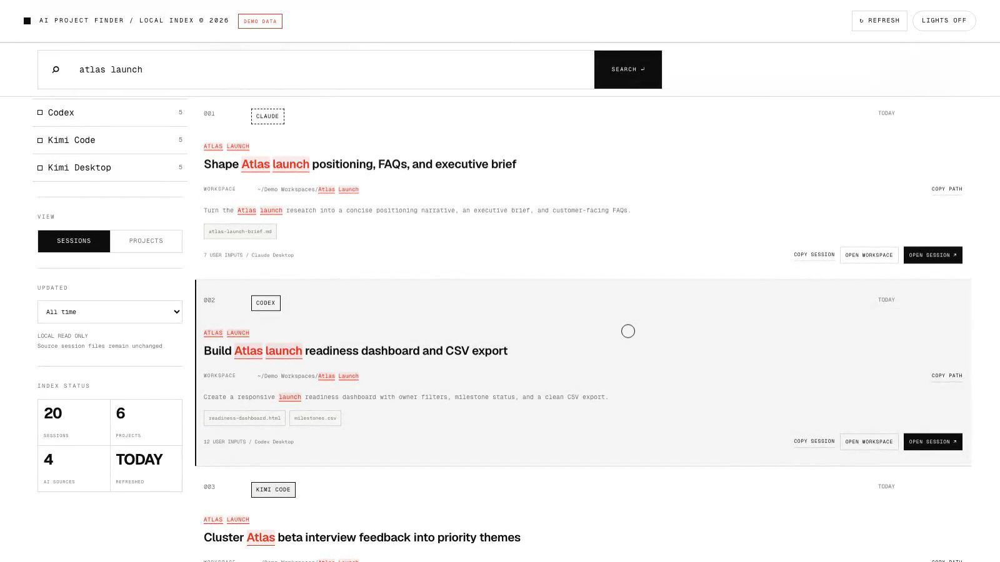

# AI Project Finder

[English](README.md) · [简体中文](README.zh-CN.md)

**A private, local search index for work spread across Codex, Claude, and Kimi.**

Search by project, client, prompt fragment, workspace, or filename, then return to the matching AI session and working directory.


> Current status: v1.2.0 with separate English and Chinese editions for macOS and Windows.

## Demo

This 26-second walkthrough runs in an isolated Demo Mode with fictional projects and synthetic AI histories. It does not read local sessions, indexes, paths, or manual traces.

[](https://github.com/stevensilu/ai-project-finder/releases/download/v1.2.0/AI_Project_Finder_Demo_EN_v1.2.0.mp4)

[Watch the English demo MP4](https://github.com/stevensilu/ai-project-finder/releases/download/v1.2.0/AI_Project_Finder_Demo_EN_v1.2.0.mp4)

The walkthrough covers:

1. Searching for `Atlas Launch` from a remembered keyword.
2. Switching between light and dark themes.
3. Moving from Sessions to Projects.
4. Filtering to Claude and previewing the open-session action.

## Why AI Project Finder

AI work is often distributed across several tools. A research thread may begin in Claude, continue in Codex, and finish in Kimi. Weeks later, the useful clue may be a client name, a file such as `launch-plan.xlsx`, or one sentence from the original request.

AI Project Finder creates one searchable view of those local histories. It helps locate:

- The AI tool that handled the work.
- The session containing the relevant context.
- The project folder or output file connected to it.

The index stays on the computer where the sessions were created.

## Key Features

### Cross-AI local index

AI Project Finder reads supported local histories from Codex, Claude Code, Kimi Code, and compatible Kimi Desktop Work sessions. Browser-only tools and cloud chats can be added as manual traces.

Default path discovery includes:

```text
Codex        ~/.codex/sessions or $CODEX_HOME/sessions
Claude Code  ~/.claude/projects or $CLAUDE_CONFIG_DIR/projects
Kimi Code    ~/.kimi-code/sessions or $KIMI_CODE_HOME/sessions
```

### Search from a remembered clue

Search covers:

- Session titles
- Project and client names
- Prompt excerpts
- Workspace paths
- Referenced filenames and artifacts

Search is case-insensitive. Every entered keyword must appear in a matched record.

### Session and project views

**Sessions** shows individual conversations. **Projects** groups multiple AI traces around the same project clue.

Results can also be filtered by source and update date, then sorted by relevance or recency.

### Return to the work

Available result actions include:

- Open the original AI session.
- Open its workspace.
- Resume a Kimi Code session in Terminal.
- Open Kimi Code Web.
- Open a saved web conversation or local path.
- Copy the workspace or session location.

Exact actions depend on the AI client, operating system, installed URL schemes, and local session metadata.

## Requirements

- macOS or Windows
- Python 3.10 or newer
- At least one supported local AI history, or manual traces

The Python application uses only the standard library. No `pip install` step is required.

## Installation

### macOS

#### Release download

1. Download and unzip [AI Project Finder — English for macOS](https://github.com/stevensilu/ai-project-finder/releases/download/v1.2.0/AI_Project_Finder_EN_macOS_v1.2.0.zip).
2. Move the folder to a stable location, such as `~/Applications/AI Project Finder`.
3. Control-click `install.command`, select **Open**, and approve the first launch.
4. The dashboard opens at `http://127.0.0.1:4388`.

The installer creates this local launcher:

```text
~/.local/bin/ai-project-finder
```

Later launches can use `start.command` or:

```bash
~/.local/bin/ai-project-finder
```

#### Git clone

```bash
git clone https://github.com/stevensilu/ai-project-finder.git
cd ai-project-finder
chmod +x install.command start.command
./install.command
```

### Windows

#### Release download

1. Download and unzip [AI Project Finder — English for Windows](https://github.com/stevensilu/ai-project-finder/releases/download/v1.2.0/AI_Project_Finder_EN_Windows_v1.2.0.zip).
2. Move the folder to a stable location, such as `%LOCALAPPDATA%\Programs\AI Project Finder`.
3. Double-click `install.bat`.
4. The dashboard opens at `http://127.0.0.1:4388`.

The installer creates this local launcher:

```text
%LOCALAPPDATA%\AIProjectFinder\ai-project-finder.bat
```

Later launches can use `start.bat` or the installed launcher.

#### Git clone

```powershell
git clone https://github.com/stevensilu/ai-project-finder.git
cd ai-project-finder
.\install.bat
```

Windows may show a SmartScreen prompt for downloaded batch files. The file can be reviewed in a text editor before selecting **Run anyway**.

## Usage

### Find previous work

The search field accepts any remembered clue, for example:

```text
Orchid launch
wholesale forecast
campaign-brief.pdf
landing page localization
```

Results update while typing. Enter or **Search** moves the page to the first result.

The English release keeps the application interface, installer messages, empty states, and Demo Mode in English. Indexed session titles and excerpts remain in their original language.

### Narrow the results

- Select one or more AI sources.
- Choose **Sessions** or **Projects**.
- Limit the update date to 30 days, 90 days, or one year.
- Sort by relevance, newest, or oldest.

### Open a result

A result may provide **Open session**, **Open workspace**, **Open CLI**, **Copy path**, or **Copy session**. Availability varies by source and client integration.

### Add a browser-only trace

Select **Add trace** and save:

- AI tool
- Project or client
- Trace title
- Conversation URL or local path
- Search keywords

Manual traces are written to `data/manual.json`. This private runtime file is created automatically on the first saved trace and is excluded from Git. The repository includes `data/manual.example.json` as an empty template.

### Refresh the index

Use **Refresh** after creating new sessions, installing another AI tool, moving a session folder, or changing a source path.

### Custom source paths

The default `config.json` uses automatic discovery:

```json
{
  "port": 4388,
  "max_prompt_chars": 9000,
  "locale": "en",
  "sources": {
    "codex": "auto",
    "claude": "auto",
    "kimi": "auto",
    "kimi-desktop": "auto"
  }
}
```

A source may be replaced with one path or several paths:

```json
{
  "sources": {
    "claude": [
      "~/.claude/projects",
      "/Volumes/Archive/claude-projects"
    ]
  }
}
```

Windows JSON paths use escaped backslashes:

```json
{
  "sources": {
    "claude": "C:\\Users\\name\\.claude\\projects"
  }
}
```

For multiple Claude Desktop profiles on macOS, an optional environment variable is available:

```bash
export AI_PROJECT_FINDER_CLAUDE_PROFILES="Claude,Claude-Work"
```

## Privacy and Security

AI Project Finder is designed around local session data:

- The Python server binds to `127.0.0.1`.
- Source session files are read without modification.
- The application has no upload or analytics endpoint.
- Generated indexes and open-diagnostic files are excluded from Git.
- Open actions use the installed AI client, Terminal, Explorer or Finder, or a saved URL.

The generated index may contain prompt excerpts, filenames, and workspace paths. The `data/` folder should be treated as private and reviewed before sharing an installed copy.

Manual traces may contain private links or project names. `data/manual.json` is intentionally excluded from version control.

The interface bundles its fonts and animation libraries inside the application. Opening the dashboard does not require a font or animation CDN.

See [SECURITY.md](SECURITY.md) for reporting guidance.

## Current Limitations

- Search is keyword-based. Semantic embeddings and fuzzy matching are not currently used.
- Exact session links depend on the URL schemes and metadata exposed by each AI client.
- Claude Desktop mapping applies to Claude Code sessions with matching local Desktop metadata. Ordinary Claude cloud chats are not indexed.
- Kimi Desktop Work detection covers its embedded Kimi Code runtime on macOS and common Windows AppData layouts. A stable exact-conversation deep link is not currently available.
- Regular Kimi cloud and web chats require a manual trace.
- Moving or deleting a source transcript can make an older open action unavailable until the index is refreshed.
- The English and Chinese editions localize application-generated interface text. Content read from an existing AI session remains in its original language.
- Windows indexing uses portable home-directory discovery. Individual session-open actions depend on the Windows client and its registered protocol support.

## Troubleshooting

### Python 3.10 or newer is required

Current installers are available from:

- [Python for macOS](https://www.python.org/downloads/macos/)
- [Python for Windows](https://www.python.org/downloads/windows/)

A custom interpreter can be selected with `AI_PROJECT_FINDER_PYTHON`.

macOS:

```bash
export AI_PROJECT_FINDER_PYTHON="/path/to/python3"
```

Windows Command Prompt:

```bat
set AI_PROJECT_FINDER_PYTHON=C:\Path\To\python.exe
```

### macOS does not open `install.command`

Control-click the file, select **Open**, and approve the first launch. The installer removes the quarantine attribute from the project folder after it starts.

### Windows does not open `install.bat`

The batch file can be opened in a text editor for review. If SmartScreen appears, select **More info**, then **Run anyway**.

### A source shows zero sessions

1. Confirm that the AI tool has created local sessions.
2. Check its default path or environment variable.
3. Use **Refresh**.
4. Add a custom source path in `config.json` when the tool uses a nonstandard location.

### A session does not open

- Confirm that the original AI client is installed.
- Confirm that the indexed transcript still exists.
- Refresh the index after moving session files.
- Review `data/open.log` for the local open mode and error category.

### Kimi Web does not open

The `kimi` binary should be available through one of these locations:

```text
$KIMI_CODE_HOME/bin/kimi
~/.local/bin/kimi
PATH
```

Kimi Code command behavior follows its [official command reference](https://www.kimi.com/code/docs/en/kimi-code-cli/reference/kimi-command.html).

### Port 4388 is already in use

An existing instance may already be available at:

```text
http://127.0.0.1:4388
```

A different port can be set in `config.json`.

## Roadmap

Areas under consideration:

- Signed macOS and Windows application packages
- Additional local AI history adapters
- Improved conversation-level deep links as clients expose stable interfaces
- Optional semantic and fuzzy search
- Import and export for manual traces
- Additional interface languages
- Broader Windows and Linux integration coverage

Roadmap items are exploratory and do not have committed release dates.

## Contributing

Issues and pull requests are welcome.

Generated indexes, open logs, manual traces, screenshots containing client names, and real session transcripts should not be attached to issues. Synthetic fixtures are preferred for parser contributions and bug reports.

Development commands:

```bash
python3 app.py --open
python3 app.py --build-only
python3 app.py --demo
python3 -m unittest discover -s tests
```

## License

MIT License. See [LICENSE](LICENSE).
